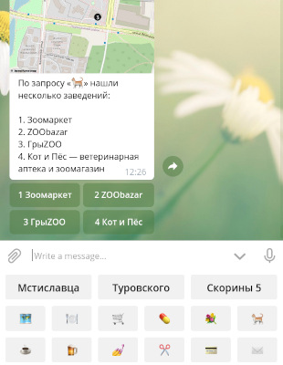

# Бот на районе

Телеграм-бот для поиска адресов и заведений в вашем районе города или
в небольшом городке. Требует недели прогулок по району для создания
базы данных, но потом удивительно красив и удобен для каждого жителя.
Посмотрите на [Навигатор по Маяку Минска](https://t.me/mayak_nav_bot),
чтобы понять, что получите.

## Документация

Инструкция по установке — лишь один из шагов. Для создания полноценного
бота вам нужно пройти все четыре учебника:

1. [Обойти дома и подъезды](docs/1-addresses.md)
2. [Установить и настроить бота](docs/2-install.md)
3. [Собрать все заведения](docs/3-poi.md)
4. [Научиться администрированию](docs/4-usage.md)

## Автор и лицензия

Бота написал Илья Зверев. Опубликовано под лицензиями WTFPL и ISC: делайте
с кодом и файлами в `config/` что хотите. Документация (этот текст и всё
в `docs/`) опубликованы под CC-BY 4.0.

## In English

This is a Telegram bot for searching for addresses and amenities
in your city block or in a smaller town. Filling in the database requires
a week of walking around, but then you'll have a pretty and useful tool
for every neighbour. Take a look at the
[Mayak Minska Navigator](https://t.me/mayak_nav_bot) to see what you can get.

While the code and comments are in English, all the strings and documetation
are not (yet) translated. The author doesn't plan to add i18n in the nearest
future, but if they get help, they might prepare a different-language
version.

Written by Ilya Zverev. Code is published under WTFPL, documentation is CC-BY 4.0.
