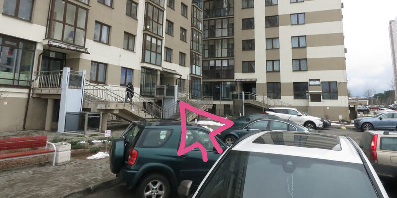

# Сбор адресов

Подготовка базы для районного бота начинается со зданий. Вам понадобятся
телефон, фотоаппарат (опционально, достаточно камеры в телефоне) и сайт
[редактора точек](https://zverik.github.io/point_ed/). Всё. Телеграм-бот
в этом этапе не участвует.

## Ваш район

Самый первый шаг: определиться с районом. Не слишком маленький, чтобы людям
не был нужен бот, но и не слишком большой, чтобы не офигеть от сбора данных.
Идеально между 20 и 40 многоквартирными домами и парой торговых центров между
ними. Главное, чтобы все заведения в районе были в пешей доступности:
найдя нужное заведение на другом его конце, человек не должен разочароваться.

В «Маяке Минска», для которого создавался этот бот, 38 домов, 73 подъезда и
порядка 450 заведений. Это много: запомнить невозможно, и на обход ушла неделя.

Район должен быть явно отделён от окружающих, чтобы пользователи не задавались
каждый раз вопросом, обращаться к боту или к другим картам.

## Разметить дома

Дома нужны для адресации и просто чтобы ответить на вопрос, где этот дом.
Не внеся дом в базу, нет смысла обходить заведения в нём.

Открывайте редактор точек и ставьте маркер (двойным щелчком) в середине каждого
дома на районе. Ставьте им такие атрибуты (это пример):

```
id  tur10
name  К. Туровского, 10
tag  building
photo  tur10
```

Идентификатор из букв и номера дома, без пунктуации. Название — это адрес. С тегом
понятно, а у фотографии будет то же значение, что у идентификатора: это не обязательно,
но для простоты.

Отметив все дома, вы узнаете фронт работ и осмотрите карту местности.

**Если вам не нужны фотографии домов и навигация по подъездам, на этом можно закончить
и сразу идти [устанавливать бота](2-install.md).**

## Идём фотографировать

Теперь, когда район знаком, откладывайте компьютер и берите фотоаппарат. И телефон.
Фотик нужен, чтобы качество снимков было хорошее, но если у вас топовый телефон, то
его достаточно. Выходим на улицу.

Для каждого дома нужны:

- Фотография всего дома, можно со стороны улицы. Она будет на карточке дома: по ней
  должно быть несложно дом идентифицировать. Хорошо, если сбоку торчат какие-то уникальные
  штуки.
- Фотографии подъездов. Лучше не каждый отдельно, а по нескольким сразу, чтобы на вид
  они не были похожи друг на друга. Лучше добавить чуть контекста, чтобы по фото было
  понятно, с какой стороны дома подъезды.
- Диапазоны квартир в каждом подъезде.
- Номер первой квартиры на каждом этаже каждого подъезда.

Последнее — не шутка, я действительно зашёл в 73 подъезда и в полусотне сфотографировал
табличку у лифта, где написано, на каком этаже какие квартиры. А в остальных пришлось
подняться на верхний этаж и потом спускаться по лестнице, записывая диапазоны квартир
на каждом втором этаже.

Если в подъезд не пробраться, то диапазона квартир на весь
подъезд достаточно. Без диапазона бот не сработает. Придумайте, как выведать коды домофонов
или постойте у каждого подъезда и зайдите за жителем.

## Обработка

### Карта

Снова открываем редактор точек (кнопка «restore» восстановит автоматически сохранённые
данные) и добавляем на карту каждый подъезд. Тегов на них будет больше:

```
id  mst6-2
name  Мстиславца 6, подъезд 2
tag  entrance
photo  mst6-2
house  mst6
index  no
```

Как видно, идентификатор и фотография созданы из идентификатора дома с суффиксом номера
подъезда. Этот формат не важен, потому что дом и его подъезды связываются через атрибут
`house`, но так удобнее. Атрибут `index` нужен, чтобы поиск по заведениям не выдавал
кучу подъездов. Можно поставить его и домам, если у них нет своих альтернативных названий.

### Номера квартир

Скопируйте в каталоге `config` файл `addr.sample.yml` в `addr.yml`. Внутри должно быть
два списка: `streets` со списком домов по улицам и `apartments` со списком квартир
по подъездам.

В первом списке важно придумать ключевые слова для поиска улицы. Важно писать их в нижнем
регистре. Не стесняйтесь добавить слова из одной буквы: удобно по «л10» получить дом 10
по улице Ленина. Обратите внимание, что в списке домов ключи — это строки. Значения —
это идентификаторы (значения `id`) точек, что мы добавили на карту выше.

В списке `apartments` ключи — это идентификаторы подъездов, а значения — это первые
квартиры в них. То есть, первый подъезд всегда будет иметь число 1. Если у вас есть
номера квартир по этажам — то делайте значение списком, где N-е число является
первом квартирой на этом этаже. Например, `[1, 5, 9]` может описывать подъезд из
трёх этажей по четыре квартиры на каждом.

Что делать, если на первом этаже, а то и на втором, нет квартир? Пользуемся тем, что
есть дробные числа, но нет дробных номеров квартир. Делаем так: `[11.8, 11.9, 12, 16, ...]`.
Тогда квартира 11 останется в прошлом подъезде, а 12 окажется уже на третьем этаже.
Делать нормальный пропуск этажей сложновато, извините.

### OpenStreetMap

Раз уж мы собрали данные, запустите JOSM или iD и отметьте все подъезды на карте.
Подъезды обозначаются `entrance=staircase`, а диапазоны квартир в них — `addr:flats` со
значениями типа `1-119`. [Читайте вики](https://wiki.openstreetmap.org/wiki/RU:Key:addr:flats).

### Фотографии подъездов

На выходе нам нужно получить отдельные фото для каждого подъезда. Именно
названия этих фотографий, в формате `len10-5` (подъезд №5 по ул. Ленина, например),
вы прописывали в тегах подъездов.

Обработать фото просто: берёте графический редактор (хоть GIMP, хоть MS Paint),
открываете в нём очередную фотографию части дома с 2-3 подъездами, и рисуете
отчётливую стрелку в сторону входа в каждый подъезд, сохраняя результаты в файлы.
Получится что-то типа такого:



### Все фотографии

Допереименуйте все фотографии в формат, который вы использовали в теге photo данных
выше. Осталась самая мелочь.

В каталоге репозитория сделайте подкаталог `photo`. Или где-нибудь в другом месте,
но тогда 1) убедитесь, что у бота есть права на запись в него, 2) пропишите путь
в ключе `photos` конфига (см. раздел 2).

Теперь фотографии нужно пожать. Ваша камера выдала файлы размером в несколько
гигабайт, телеграм же пожимает все фоточки в 100-200 килобайт. Кроме того, телеграм
уменьшает их до примерно 1280 точек по длинной стороне. Так давайте сделаем
примерно то же самое — заодно и место на сервере сэкономим.

Проще всего это сделать через [ImageMagick](https://ru.wikipedia.org/wiki/ImageMagick):

    for i in *.JPG; do convert "$i" -resize 1280x1280 -strip -quality 85 /<path_to_bot>/photo/$(basename $i .JPG).jpg; done

Что эта строчка делает: берёт все файлы с расширением `.JPG` (заглавными буквами, как
обычно делает фотоаппарат), уменьшает до 1280 точек по длинной стороне (`-resize`),
удаляет EXIF и прочую муть (`-strip`), пожимает в JPEG с качеством 85 (`-quality`),
меняет расширение на `.jpg` строчными буквами (`$(basename)`) и сохраняет
в созданный ранее каталог `photo`.

Если это слишком сложно, воспользуйтесь средствами пакетного перекодирования
изображений вашей системы. Обращу внимание, что расширение должно быть `.jpg`
строчными буквами. На регистронезависимость файловой системы не полагайтесь.

## Проверить хвосты

Итак, у вас около сотни фотографий (если вы амбициозны) домов и их подъездов.
Всяко что-то забыли или опечатались. Как проверить, что все фотографии на
месте?

Для этого нужно немного забежать вперёд. Установите бота, как написано
в следующем разделе. Загрузите в него данные, как написано там же. И запустите

    python3 -m raybot buildings

Скрипт проверит содержимое базы, файла `addr.yml` и каталога `photos`, и выдаст
сводку, в которой будут сообщения четырёх типов:

* "Missing photo: kur1-6.jpg" — на эту фотографию ссылается здание или подъезд,
  но её нет.
* "No photo listed: pil10-1" — у подъезда с таким идентификаторов не прописан
  тег `photo`, и поэтому на фотографию не ссылаются.
* "Weird apmt sequence in kur15-2: 0.5, 1" — на этаже меньше двух или больше
  десяти квартир. Иногда срабатывает на хак, когда мы пропускаем второй-третий
  этажи.
* "Entrance len33-1: last floor 20 apmt 205" — проверьте по своим записям,
  что в этом подъезде действительно 20 этажей.

**Когда всё готово и подчищено, приступайте ко второй части: [установке бота](2-install.md).**
