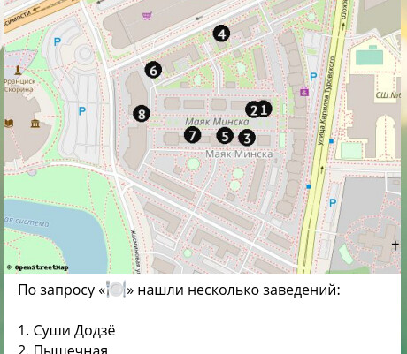

# Установка и настройка бота

## Установка

Начинается установка так же, как и все остальные: клонированием
git-репозитория:

    git clone https://github.com/Zverik/bot_na_rayone.git

Следующий шаг тоже традиционен: сделайте окружение virtualenv
привычным вам способом. Например:

* `python3 -m venv venv`
* `pipenv install`
* `hatch env na_rayone`

И иногда нужно будет запустить `pip` из этого окружения:

    pip install -r requirements.txt
    pip install -r requirements2.txt

Да, два списка один за другим. Второй содержит только одну строку:
автор сам запутался в зависимостях, и проще сделать грязный хак,
чем чинить `setup.py` за автором. Да, там мой форк, pull requests
welcome.

В конце проверьте, что бот запускается, командой (из-под окружения):

    python -m raybot help

### Ansible

На сервер автора бот установлен и управляется через Ansible. Это такая
чудесная система программирования состояний сервера на файлах yaml.
[Вот здесь](https://github.com/Zverik/ansible-tile/tree/master/roles/mayak_nav_bot)
опубликована роль для бота. Роль легко читается и может служить
пошаговой инструкцией для ручной установки.

Обратите внимание на часть про установку свежего Python: в коде использованы
датаклассы, введённые в Python 3.7, поэтому версии старее этой не поддерживаются.
Это может быть проблемой на Ubuntu 18.04, Debian Stretch и CentOS 8.

## Регистрация бота

Как всегда, новый бот делается через [@BotFather](https://t.me/botfather).
Пишете там `/newbot` и проходите все этапы. В конце получите длинную
строку токена, которую нужно прописать в `config/config.yml` в поле
`telegram_token`.

Помимо прочего, BotFather командой `/setcommands` предлагает подсказать
пользователям, какие команды бот поддерживает. Скопируйте туда вот это:

```
start - Приветствие и кнопки поиска
help - Справка и статистика
popular - Популярные заведения
random - Несколько случайных заведений
my - Мои отмеченные заведения
msg - Написать модераторам
```

## Тайлы

В первой части мы готовили фоточки. Если вы её пропустили, то сделайте
каталог `photo` внутри каталога с ботом. Или где-нибудь в другом месте, но
тогда убедитесь, что бот может туда писать, и пропишите путь в `config.yml`
в поле `photos`.

Если вы хотите, чтобы кроме фоточек, у заведений была мини-карта, и списки
заведений тоже приходили с картой, на которой расставлены цифры результатов,
то нужны тайлы. Тайлы — это растровые квадратики 256×256 точек, из которых
собраны интерактивные карты на многих сайтах, включая OpenStreetMap. Они
поделены на уровни масштаба, где квадратик на масштабе N состоит из четырёх
квадратиков (2×2) масштаба N+1. Вам нужны тайлы масштабов 15-17, а то и 14,
если город слишком большой.



Есть два способа тайлы получить: скачать и сгенерировать. Учитывая небольшой
объём данных (около 200 файлов или 3 МБ), оба варианта хороши. Второй требует
чуть больше работы, но даёт результат красивее. Важно, чтобы на тайлах не было
заведений (POI), но были дороги с их названиями, здания с номерами и побольше
местного контекста.

Вот несколько ссылок:

* Скачать выгрузку OpenStreetMap для своего города: BBBike, Interline или OSMaxx
  [из этого списка](https://wiki.openstreetmap.org/wiki/Processed_data_providers).
* Стиль [OSM Carto](https://github.com/gravitystorm/openstreetmap-carto/) включает
  в себя [образ Docker](https://github.com/gravitystorm/openstreetmap-carto/blob/master/DOCKER.md)
  для загрузки файла pbf в базу PostgreSQL.
* Добавив к тому образу [Docker для TileMill](https://github.com/schachmett/docker-tilemill/blob/master/Dockerfile),
  получите редактор стилей на CartoCSS с выгрузкой в тайлы (параметры соединения:
  `host=db dbname=gis`).
* Установив `python3-mapnik` и пару других модулей, можно сделать тайлы
  из базы PostgreSQL и стиля Mapnik скриптом [polytiles](https://github.com/Zverik/polytiles).
* Можно нарисовать карту в QGIS (или купить основу [у NextGIS](https://data.nextgis.com/))
  и установить модуль Processing. В нём найдите команду "Generate XYZ tiles (Directory)".

Если тайлы в формате MBTiles, то [распакуйте](https://github.com/mapbox/mbtiles-spec/wiki/Implementations)
их в набор файлов `*.png`. Должны получиться каталоги с числовыми названиями:
`15`, `16` и `17`. Создайте каталог `tiles` внутри каталога с ботом (или
в другом месте, прописав путь к нему в `config.yml` в поле `tiles`) и
переместите эти числовые каталоги туда.

## Настройка

Бот ожидает найти несколько файлов в формате yaml в каталоге `config`.

* `config.yml` — мы его делали на протяжении инструкций. Важные ключи
  для него — `telegram_token` и `admin_id`, которые мы заполнили выше.
  Остальные ключи, кроме путей, задокументированы в `config.sample.yml`.
  Пропишите путь к логам в `logs` (должны быть права на запись!) и
  прямоугольник вокруг вашего района в `bbox`. Последний нарисуйте
  на [этом сайте](https://boundingbox.klokantech.com/), выберите
  внизу формат "CSV" и скопируйте числа.
* `responses.yml` — второй по важности файл после `config.yml`.
  Скопируйте его из `responses.sample.yml` и поправьте поля в нём:
  - `start` и `help`: сообщения по командам `/start` и `/help`
    соответственно.
  - `buttons`: список списков для кнопок под полем ввода. То есть,
    список строк, каждая строка — список кнопок. Строки на кнопках
    отправляются в поиск напрямую.
  - `synonims`: список синонимов для ключевых слов. Помогает делать
    кнопки из эмодзи, а не из обычных слов.
  - `responses`: здесь можно добавить ответов роботу. Поле `name` выводится
    как заголовок, `message` содержит полное длинное сообщение, `photo`
    содержит имя картинки для ответа (должна быть в каталоге с фотографиями),
    `keywords` (единственное обязательное поле) — список ключевых слов,
    по которым вернётся этот ответ. Важно, что эти ключевые слова затмевают
    все заведения с такими же словами.
  - `skip`: ключевые слова, которые не учитываются в поиске.
* `addr.yml` — дома, подъезды и номера квартир в них. Этот файл описан
  в [прошлом разделе](1-addresses.md).
* `tags.yml` — теги OpenStreetMap и дополнительные с описаниями и синонимами.
  Используется для поиска и для панели тегов в редакторе. Описан
  в [следующем разделе](3-poi.md).
* `strings.yml` — строки, которые видит пользователь. Редактировать не нужно,
  разве что вы заходите перевести на другой язык. Мультиязычность пока
  не поддерживается.

## Запуск

Запустить бота просто: из-под виртуального окружения выполните такое:

    python -m raybot

Появится строчка про start polling, и можно открыть телеграм и нажать
«Start». После этого можно отправить боту команды или ключевые слова.
Если обходили дома и подъезды, то попробуйте ввести улицы и числа.

У библиотеки aiogram есть [странный баг](https://github.com/aiogram/aiogram/issues/485):
на некоторых операционных системах второй ответ может занять до двух минут.
В проде этого у меня не случалось.

### Systemd

На сервер бота лучше ставить не для запуска из командной строки
(это довольно странно для сервера), а как сервис systemd. Это несложно:
сделайте файл `/etc/systemd/system/nav_bot.service` с
[таким содержимым](https://github.com/Zverik/ansible-tile/blob/master/roles/mayak_nav_bot/files/mayak_nav_bot.service).
Поправьте в нём `User`, `Ground`, `WorkingDirectory` и `ExecStart`.
Дальше — как обычно:

    sudo systemd start nav_bot
    sudo systemd enable nav_bot

Чтобы посмотреть логи, сделайте `sudo journalctl -u nav_bot`. Остальные
три лога будут либо в каталоге бота, либо в каталоге, который вы
прописали в ключе `logs` в `config.yml`.

**Теперь у вас запущен бот и настроены его ответы. Но база заведений пуста.
Как её заполнить, читайте в [третьей части](3-poi.md).**
