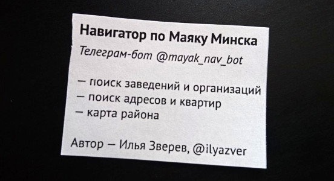
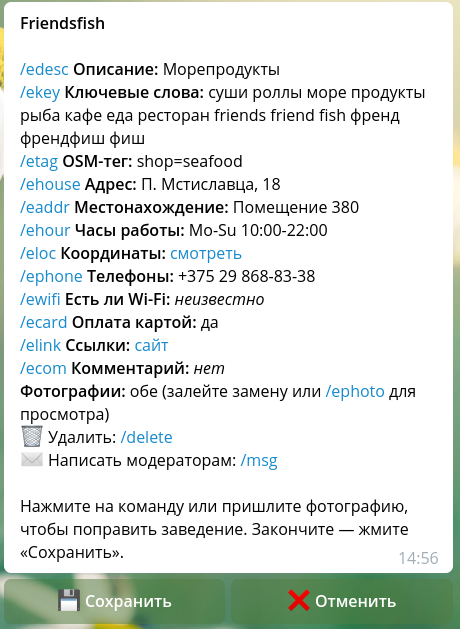

# Сбор заведений

Наконец-то мы готовы к сбору заведений! Если вы ещё нет, прочитайте
[вторую главу](2-install.md). Предполагаем, что бот установлен — не важно,
на сервере или на вашем компьютере, который вы не выключаете перед уходом.

Поскольку вы будете обходить заведения и этим вызывать много вопросов,
советую напечатать и нарезать минимум полсотни «визиток»: квадратиков
бумаги, на которых написаны название и адрес бота, что он делает и как
с вами связаться. Я раздавал такие:

Зарядите телефон до 100%. Если он не слишком живучий, возьмите запасную батарейку.
Убедитесь, что мобильный интернет работает, и введите команду для своего бота
в телеграме, чтобы проверить, что он отвечает. Можно выходить! (Но сначала
прочитайте инструкцию до конца, конечно.)

## Добавление заведения

Введите название нового заведения, чтобы убедиться что его нет в базе.
Уверены — вводите любую чушь. К сообщению об отсутствии результатов прилагается
кнопка «Добавить заведение» — жмите. Дальше нужно будет ввести:

1. Название, как написано на вывеске. Совершенно нормально писать «Продукты»
   или «Цветы». Но желательно как-то различать похожие заведения: например,
   списать с таблички номер «Аптека №13» или юрлицо «Продукты "Мария"».
2. Координаты. Нажмите кнопку со скрепкой и выберите «Location» или
   «Геопозиция». Для верности включите спутниковую подложку (кнопка со слоями
   справа вверху) и передвиньте маркер как можно ближе ко входу в заведение.
   Отправляйте.
3. Ключевые слова — самое важное для поиска заведения. Введите через пробел
   как можно больше терминов, которые могут прийти в голову человеку, который
   ищет это заведение. Начните с вариантов транслитерации и опечаток: например,
   для магазина «Green» это может быть «грин gren grin». Затем опишите
   ассортимент или услуги, как общими, так и конкретными словами, если они
   просятся на язык: «бытовая химия мыло шампунь шампуни крем порошок стиральный».
   Не стесняйтесь добавлять словоформы («детей детям детские детский»): поисковый
   движок не умеет склонять слова. Чем больше — тем лучше, но не переборщите,
   чтобы не смешать воедино кафе и продуктовые магазины, например.

Придумывая ключевые слова, помните, что потом вы сможете указать ещё и тип заведения.
Не обязательно придумывать синонимы к слову «стрижка», если вы добавляете
парикмахерскую: они уже связаны с этим типом заведения в файле `config/tags.yml`,
в списке для тега `shop=hairdresser`. Часто в ключевых словах достаточно просклонять
название и списать несколько терминов с фасада заведения.

Ответив на три вопроса, вы перейдёте в режим редактирования созданного заведения.

## Редактирование заведения

Этот режим открывается при создании заведения, либо при нажатии кнопки «Поправить»
в карточке магазина или организации. При редактировании вы, по сути, заполняете полтора
десятка полей в записи в базе данных:

Нажмите на любую из команд `/e...`, чтобы изменить значение соответствующего поля.
Некоторые из них — обычные строки, которые нужно будет ввести как есть (например,
описание и местонахождение). Некоторые — переключатели между «да», «нет» и «не знаю»
(wi-fi и оплата картой). Поля адреса (дома) и тега предложат несколько вариантов,
хотя в последний можно вписать и свой. А у часов работы и сайтов особый формат строк,
чтобы упростить ввод на улице.

В качестве сайта можно ввести самую основу: например, `Supershop. Ru`. Это превратится
в `сайт https://supershop.ru`, где `сайт` — это ключ для сайта по умолчанию. Можно
ввести много сайтов с разными ключами; главное — чтобы в ключе не было пробелов.
Для инстаграма, vk и фейсбука сработает короткая форма с названием аккаунта: например,
`инстаграм super_beauty.minsk`.

Часы работы вводятся просто, но форму нужно запомнить. Бот подсказывает примеры и их,
в принципе, достаточно:

* `8-20`: если работает всю неделю, то достаточно двух чисел через дефис.
* `пн-пт 10-19:30`: интервал дней недели можно указать и через пробел (`пн пт 10-20`),
  минуты пишутся с двоеточием.
* `пн-чт 10-20 обед 13-14, пт-вс 10-18`: интервалы для разных дней недели соединяются
  запятыми. Например, `пн пт 10-20, сб 11-19`. Ключевое слово `обед` нужно для указания
  одного перерыва.

Значение строкового поля можно очистить, введя единственный символ `-`. Если всё сломали
и поздно что-то исправлять — не беда, понажимайте «Оставить как есть» и «Отменить».
И главное — не забудьте нажать «Сохранить» после редактирования.

Какие поля заполнять обязательно? Формально — только название и координаты. но желательно
как минимум половину всех полей:

- название (можно поправить секретной командой `/ename`)
- координаты
- ключевые слова
- тег
- адрес (дом), если у вас в базе есть дома
- время работы
- хотя бы одну ссылку или телефон
- фотографию снаружи (см. ниже)

Не стесняйтесь заходить и спрашивать визитку или недостающие данные. Я ещё не встречал
владельца или сотрудницу(-ка), которая была бы против добавления их магазина, заведения
или организации в каталог. Не забудьте в обмен на информацию оставить визитку.

### Фотографии

Добавить фотографию просто: прикрепите её в чатик (обязательно со сжатием!), и затем
ответьте на вопрос, она сделана снаружи заведения, изнутри, или это ошибка и фото
лучше удалить. Но где лучше сделать фотографии?

Идея фотографий в том, что первая показывает, как на улице найти вход, а вторая — что
вы пришли туда, куда нужно. То есть, в случае магазинов, в которые вход с улицы,
фотография «снаружи» — это дверь магазина с тротуара. Впрочем, для заведений в торговых
центрах, в которые много входов, тоже фотографируем дверь с улицы. Нужно отойти достаточно,
чтобы по вывескам, номерам и прочему контексту было элементарно найти и определить
правильный вход. Но не так далеко, чтобы вход был не видел, или на фото было несколько входов.

Фотографию изнутри в теории делают прямо ото входа, чтобы было понятно, куда пришли.
С другой стороны, полезнее на фотографии отразить ассортимент магазина или обстановку
заведения. В некотором смысле фотография изнутри должна «продавать» заведение: по ней
могут выбрать кафе из нескольких, или магазин игрушек по ассортименту.

В торговом центре расстановка фотографий может поменяться. Если фото снаружи содержит
вход в торговый центр, то фото изнутри может показывать фасад магазина из коридора
торгового центра. Это полезнее ассортимента, потому что помогает вообще найти заведение,
заметить его краем глаза издалека. Если фасад полупрозрачный, то даже лучше: две цели
одной фоточкой.

### Теги

Выбрать тип для заведения — редко простая задача. Салон красоты или мастер по ногтям?
Кафе или ресторан? Магазин цветов или подарков? Магазин сыра — это куда?

Для типизации бот не изобретал велосипед, а использует систему тегирования OpenStreetMap.
В ней используются теги: пары строк `ключ=значение`. Чтобы получить представление о том,
что можно обозначить, прочитайте списки на страницах ключей
[shop](https://wiki.openstreetmap.org/wiki/RU:Key:shop),
[amenity](https://wiki.openstreetmap.org/wiki/RU:Key:shop),
[craft](https://wiki.openstreetmap.org/wiki/RU:Key:shop),
[tourism](https://wiki.openstreetmap.org/wiki/RU:Key:shop) и
[leisure](https://wiki.openstreetmap.org/wiki/RU:Key:shop). Сложные вопросы часто
решаются поиском термина по странице
«[Как обозначить](https://wiki.openstreetmap.org/wiki/RU:%D0%9A%D0%B0%D0%BA_%D0%BE%D0%B1%D0%BE%D0%B7%D0%BD%D0%B0%D1%87%D0%B8%D1%82%D1%8C)».
Наконец, посмотрите, какие ключевые слова соотнесены с тегами в файле
`config/tags.yml`.

Разумеется, модель OSM — не догма. После обхода своего района я добавил в классификацию
теги, которых нет в OSM, но которые помогают разделить заведения по классам:

* `amenity=art_school`, `dancing_school`, `driving_school`, `language_school`,
  `music_school` — понятно, занятия по рисованию, танцам, вождению, языкам, музыке.
* `amenity=beauty_school` — уроки макияжа и маникюра
* `amenity=coffee` — кофейня. Отличается от кафе отсутствием горячей еды: разве что
* `amenity=school` означает кружок для школьников, а `amenity=childcare` — развивашки
  и просто передержку вместо детсада.
* `shop=instagram_beauty` — салон красоты, таргетирующийся исключительно на пользователей
  инстаграма. Часто кроме названия аккаунта и телефона на вывеске ничего нет.
  булочку могут разогреть.
* `shop=marriage_salon` — свадебный салон.
* `shop=skin_care` — всякая эпиляция-депиляция, `shop=hair_care` — салон ухода за волосами,
  что не совсем парикмахерская.
* `amenity=restaurant` убран в пользу `=cafe`, а `shop=supermarket` — в пользу `=convenience`.
* `shop=veg_food` — вегетарианские и веганские продукты.

Если не знаете, какой тег поставить, оставляйте поле пустым. Позже мы пройдёмся по всем
заведениям и придумаем недостающие теги.

## Причёсываем базу

Когда каждый дом обойдён, осталась самая малость: привести базу в порядок. Координаты,
выбранные по спутниковому слою, неточны, какие-то поля забыли заполнить, тегов не хватает.
Проще всего править объекты скопом не в телеграме, а на компьютере, в интерактивной карте.

Остановите бота простым Ctrl+C, если он запущен в консоли, или `sudo systemctl stop nav_bot`.
Затем из виртуального окружения сделайте:

    python -m raybot export pois.geojson

Полученный файл откройте в [редакторе точек](https://zverik.github.io/point_ed/), который
мы использовали на первом этапе. Редактировать точки в нём просто: тыкните в маркер, правьте
атрибуты, двигайте этот маркер. Для сохранения жмите «Close», кнопку «Esc» или тыкайте
в пустое место на карте. Думаю, названия атрибутов точек очевидны: посмотрите на несколько
заведений, чтобы понять схему.

На этом шаге нужно пользоваться строкой фильтра. Её формат похож на формат поиска в JOSM.
Вот несколько примеров:

* Заведения без адреса — `-house`.
* Заведения без тега — `-tag`.
* Подъезды — `tag=entrance`.
* Заведения со словом «вход» в местоположении — `address:вход`.
* Заведения _без_ слова «вход» — `-address:вход`.
* Салоны красоты со ссылкой на инстаграм — `tag=shop=beauty links:инстаграм`.
* Салоны красоты без времени работы — `tag=shop=beauty -hours`

Перетащите заведения, которые оказались на улице, в помещения, правильно расставьте
ссылки на здания в теги `house` (если в базе есть дома).

Когда работа закончена, скачайте результат («Download the result») и загрузите обратно в базу:

    python -m raybot import pois.geojson

### Классификация

В разных городах и странах водятся разные виды магазинов и заведений. Поэтому классификация,
которую сделали в боте для Минска, может не подойти условному Хабаровску. А в ваших собранных
заведениях осталось много пропусков в тегах, потому что «в поле» было непонятно, куда отнести,
да и знания тегов OpenStreetMap у вас не идеальны.

Давайте выгрузим список заведений и их тегов (или пропусков вместо них) в таблицу:

    python -m raybot export_tags poi_tags.csv

Откройте этот файл в Excel, LibreOffice Calc или Google Таблицах. Закрепите первую строку
для удобства. Не трогайте первую колонку с идентификаторами. Мы будем работать только с третьей
и с четвёртой.

Заполните пропуски в третьей колонке, и для них укажите русское название категории в
четвёртой. Используйте список в `config/tags.yml` для справки. Не стесняйтесь придумывать
новые классы заведений. Когда пустых мест останется минимально, вспомним, зачем нам ещё теги:
чтобы находить похожие заведения. Именно поэтому объединены кафе и рестораны: их не так много,
чтобы лишать тех, кто ищет еду, половины списка. Так что попробуйте что-нибудь из нового
объединить.

Когда закончите, сохраните таблицу в CSV и загрузите её обратно в базу данных:

    python -m raybot import_tags poi_result.csv new_tags.yml

Второй файл будет содержать записи с новыми тегами для файла `tags.yml`. Скопируйте его
в конец раздела `tags` и досыпьте ключевых слов каждой категории.

**Теперь база заведений должна быть в порядке. В принципе, бота в этот момент можно
анонсировать. Но лучше прочитайте сначала [следующую главу](4-usage.md), чтобы
уметь держать базу в порядке и отвечать на вопросы пользователей.**
