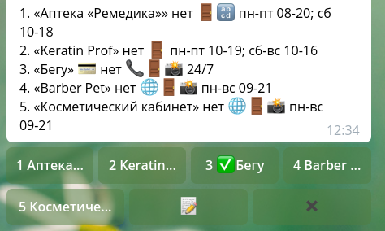

# Обновление данных

Со временем ваша база заведений устареет. И это не через год, а через пару недель:
новые магазины и заведений открываются постоянно, старые закрываются. Если базу
не трогать целый год, то бот покроется плесенью: люди перестанут соотносить его
вывод и то, что работает на самом деле. Поэтому базу нужно регулярно обновлять.

Есть соблазн смалодушничать и оставить всё на самотёк: в боте же есть кнопки удаления,
«добавить заведение» и «поправить». Что стоит человеку, который видит несоответствие,
нажать одну из них? На практике, даже владельцы заведений предпочитают написать
админу (в личку, а не через бота), чем разбираться с интерфейсом. Смиритесь: даже
самый удобный интерфейс не заставить пользователей делать больше необходимого.

## Режим осмотра

Прислав геопозицию или найдя дом, модераторы увидят одну дополнительную кнопку:
«Осмотреть заведения». Она запускает режим осмотра, когда выводятся до 14 заведений
одновременно, и их можно отмечать просмотренными.

Схема такая: вы подходите к зданию и оцениваете, нужно ли в нём этажи обходить
отдельно, или можно всё сразу. Ищете адрес этого здания (например, «ленина 5»)
и жмёте «осмотреть». Затем выбираете этаж или жмёте «все».

Осматривать можно не больше 14 заведений за раз (чтобы кнопок было не больше 4 рядов).
Если их больше, то пришлите боту геопозицию. Можно начать осмотр прямо после
её отправки — но тогда не будет органичения по дому. Это удобно, когда
осматриваете торговый центр, занимающий несколько домов, но обычно лучше начать
с поиска адреса.

На панели осмотра перечислены заведения и есть по кнопке для каждого. Нажав
на кнопку, вы подтверждаете, что заведение на месте. Повторное нажатие снимет
галочку, если вы нажали случайно. Кнопка с крестиком, очевидно, завершает осмотр.
А кнопка редактирования меняет режим: после её нажатия кнопки заведений открывают
редактор для выбранного заведения. Осмотр можно продолжить после завершения
или отмены редактирования.

### Описание заведения

В списке заведений указано не только имя, но и куча других атрибутов. Так что
отсюда же можно проверить, что данные правильные, и заполнить недостающие поля.
Строка заведения делится на четыре группы:

1. Номер и название в кавычках.
2. Значки wi-fi и карточек / наличных, если указаны.
3. Слово «нет» и список значков для атрибутов, которые не указаны.
4. Часы работы или слова «нет часов», если не указаны.

Со значками во второй группе понятно, а в третьей их многовато. Вот что они
означают:

- 📞: телефон;
- 🌐: сайт;
- 🚪: местоположение (помещение, вход);
- 🔡: ключевые слова;
- 🌄: фото снаружи;
- 📸: фото изнутри.

Напомним, что ни один из этих атрибутов — кроме фото снаружи, пожалуй, — не обязателен.
Но если вы, например, видите номер телефона на вывеске, а значок показывает,
что он не указан, то самое время его внести.

### Состав списка

Что делать, когда заведения нет в списке? Велик шанс, что оно новое. Действуйте,
как обычно: пришлите боту подходящие термины для поиска и убедитесь, что заведения
точно нет, а не что там ошибка с этажом или зданием. Потом жмите «добавить» и добавляйте.
Новое заведение не появится в списке, и это нормально.

Когда заведение из списка не найти, это тоже может означать ошибку, а не что оно закрылось.
Откройте его в редакторе и нажмите `/ephoto`, чтобы посмотреть его фоточки. Если
есть номер помещения, то он тоже поможет найти заведение. И только убедившись, что
оно на самом деле закрыто, жмите из редактора `/delete` и пишите «закрылось».

Если в списке 14 заведений, то есть шанс, что какие-то не влезли в список. Осмотрев
большую часть, пришлите боту свою геопозицию. Он перестроит список, упорядочив его
по удалённости от вас и убрав осмотренные заведения. Таким образом вы получите
следующую партию и продолжите осмотр. Повторяйте, пока не упрётесь в стену.

**Обходите все заведения хотя бы раз в два месяца: без этого данные устареют,
и ваш бот разочарует пользователей.**
